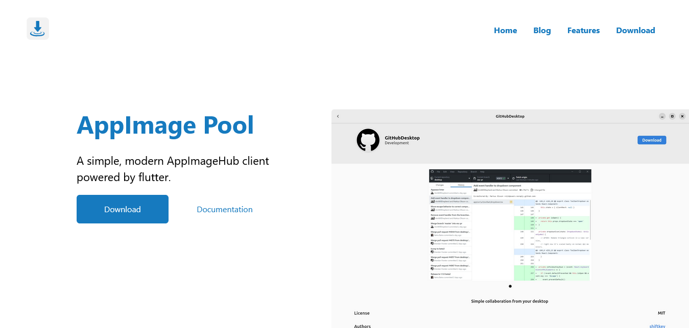

<center>
    <h1>appimagepool.github.io</h1>
    <p>The website for AppImage Pool, a simple, modern AppImageHub client powered by flutter.</p>
</center>




## Development

To run the development server:

```bash
npm run dev
# or
yarn dev
```

Open [http://localhost:3000](http://localhost:3000) with your browser to view the website.

## Writing A Blog Post

Place a file ending in `.mdx` in the `posts` directory. At the top of the file some metadata is required.

**Example**
```mdx
---
title: 'An Interesting Post Title'
author: 'John Doe'
date: '2022-02-09'
description: 'A Really Amazing Description'
thumbnailUrl: '/interesting_post_thumbnail.jpg'
tags: ['Add', 'Some', 'Tags']
draft: true
---
```

*Note: Tags and the draft settings are not currently implemented*

**Title** The title of the blog post

**Author** The author's name

**Date** The date in YYYY-MM-DD

**Description** A summary of the post

**Thumbnail URL** The path to the thumbnail image from the `public` directory

**Tags** Some words to describe the general type of post (e.g. `Announcement`, `Technical` etc.)

**Draft** Marks if this post is a draft (i.e. whether it should be published yet). Either set to `true` or `false`. Defaults to `false`

